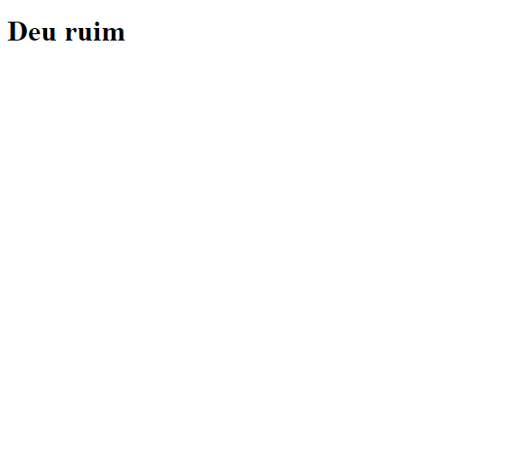
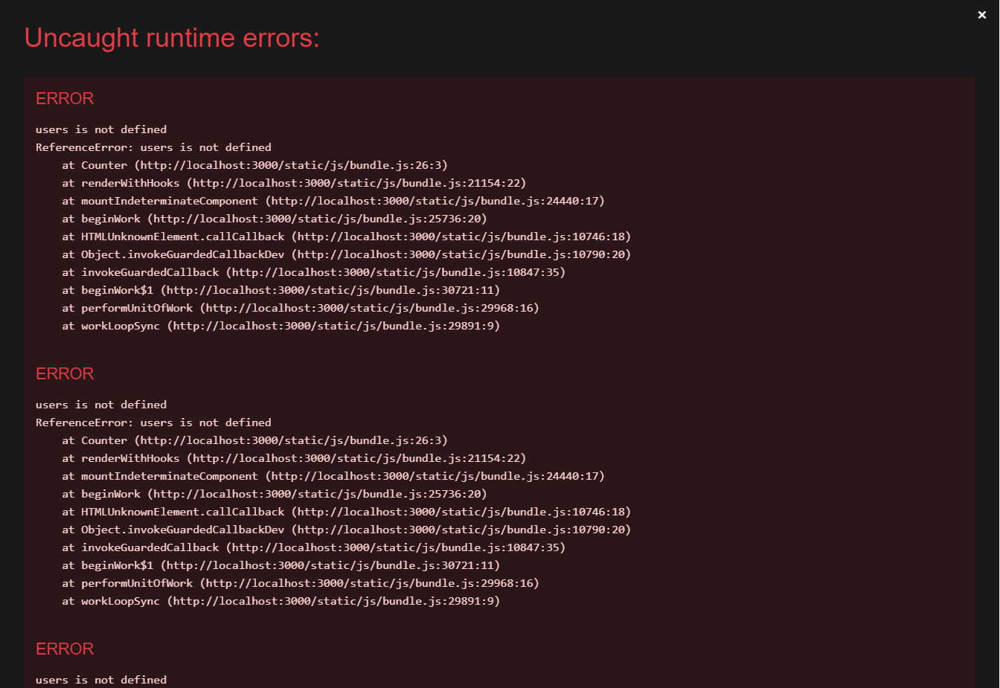
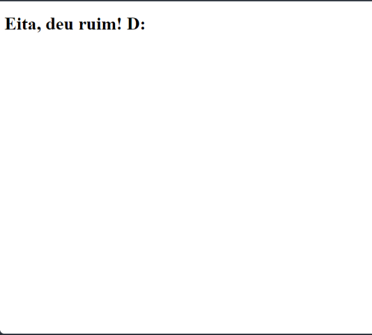
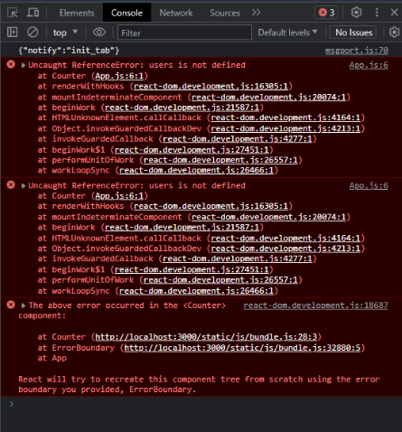
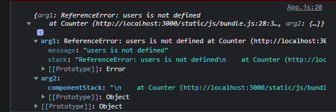

<p align="center">
<a href="https://github.com/he4rt/4noobs" target="_blank">

</a>
</p>

# O que é Error Boundaries?

Antes do React 16 as aplicações costumavam crashar quando ocorria algum erro de javascript, como por exemplo erro de tipagem. Os componentes corrompiam o estado interno e retornavam erros imcompreensíveis, erros esses causados por erros anteriores no código da aplicação, mas não tinhamos como trata-los, então as aplicações acabavam crashando e o usuário era forçado a recarregar a página.

A partir do React 16, temos o conceito de Error boundaries que é basicamente um trycatch em forma de componente, utilizados para capturar e tratar erros de javascript. Os componentes de error boundaries são necessariamente componentes de classe, porque devem acessar ao método `componentDidCatch(error, info)`, que é o método responsável por capturar o erro em tempo de execução. Também podemos usar o hook `react-error-boundary` caso opite por componentes funcionais, mas não temos nenhum hook equivalente ao `componentDidCatch()`.

É ideal usar um Error Boundary para evitar crashs na aplicação, como tratamento de erros e para exibir uma interface alternativa para o usuário.

Em certos tipos de erro não conseguimos usar o Error Boundary:

- Manipuladores de evento
- Código assíncrono (ex. callbacks de setTimeout ou requestAnimationFrame)
- Renderização no servidor
- Erros lançados na própria error boundary (ao invés de em seus filhos)

# Utilização

Nesse componente estamos usando o try...catch para tratar um erro no componente `<Counter />`, e isso de fato funciona, a tag `h1` é exibida no tratamento do erro.

```jsx
import React from 'react'

const Counter = () => {
  try {
    users?.map(({ user }) => {
      return <h1>He4rt User: {user}</h1>
    })
  } catch {
    return <h1>Deu ruim</h1>
  }
}

const App = () => {
  return <Counter />
}

export default App
```


Mesmo dando erro, ele compila a aplicação:



---

Porém, se não queremos usar o `try...catch` dentro do `Counter` e passar ele para um contexto superior, o `App` não irá conseguir tratar o erro, vejamos:

```jsx
import React from 'react'

const Counter = () => {
  users?.map(({user}) => {
    return <h1>He4rt User: {user}</h1>
  })
}

const App = () => {
  try{
    return <Counter />
  } catch(){
    return <h1>Deu ruim</h1>
  }
}

export default App
```

Erro:


E isso traria problemas caso quiséssemos tratar o erro de uma renderização de páginas por exemplo, e quiséssemos usar a mesma tratativa para todas as páginas.

# Criando um componente Error Boundaries

```jsx
import React, { Component } from 'react'

class ErrorBoundary extends Component {
  constructor(props) {
    super(props)
    this.state = { hasError: false }
  }

  // Este método é chamado quando ocorre um erro em qualquer componente filho
  componentDidCatch(error, info) {
    this.setState({ hasError: true })
    // Você pode registrar o erro ou realizar ações específicas aqui
    console.error('Erro capturado:', error)
    console.error('Informações do erro:', info)
  }

  render() {
    // Se ocorreu um erro, você pode renderizar uma mensagem de erro personalizada
    if (this.state.hasError) {
      return <p>Desculpe, algo deu errado.</p>
    }

    // Se não houve erro, renderiza normalmente os componentes filhos
    return this.props.children
  }
}

// Exemplo de componente que pode gerar um erro
class ComponenteComErro extends Component {
  render() {
    // Simulando um erro (isso seria geralmente uma operação que pode falhar)
    throw new Error('Erro simulado!')
    return <div>Conteúdo do componente com erro</div>
  }
}

// Componente pai usando o ErrorBoundary
class App extends Component {
  render() {
    return (
      <ErrorBoundary>
        <div>
          <h1>Minha Aplicação</h1>
          <ComponenteComErro />
        </div>
      </ErrorBoundary>
    )
  }
}

export default App
```

# Utilizando o `react-error-boundary`

Como visto anteriormente, necessariamente componentes de Error Boundary são criados como componentes de classe, mas componentes de classe já estão depreciados. Então podemos usar o [react-error-boundary](https://github.com/bvaughn/react-error-boundary) para utilizar Error Boundaries como componentes funcionais que está mais próximo aos códigos React que vemos no dia a dia.

Vejamos como implementar o `react-error-boundary` seguindo o mesmo exemplo anterior:

```jsx
import React from 'react'

import { ErrorBoundary } from 'react-error-boundary'

const Counter = () => {
  users?.map(({ user }) => {
    return <h1>He4rt User: {user}</h1>
  })
}

const ErrorHandler = () => {
  return <h1>Eita, deu ruim! D:</h1>
}

const App = () => {
  return (
    <ErrorBoundary FallbackComponent={ErrorHandler}>
      <Counter />
    </ErrorBoundary>
  )
}

export default App
```

Resultado:



Terminal:



Veja que criamos um componente fallback para exibir caso ocorra algum erro em qualquer componente que está encapsulado no `<ErrorBoundary />`, onde diferente do `try...catch`, conseguimos fazer uma tratativa de erro global. Então se tivessemos vários componentes encapsulados no `<ErrorBoundary />` e algum deles ocorresse algum erro que não foi tratado localmente, seria exibido o componente da fallback

# Método `onError`

Usando o exemplo anterior, podemos adicionar o método `onError`:

```jsx
import React from 'react'

import { ErrorBoundary } from 'react-error-boundary'

const Counter = () => {
  users?.map(({ user }) => {
    return <h1>He4rt User: {user}</h1>
  })
}

const ErrorHandler = () => {
  return <h1>Eita, deu ruim! D:</h1>
}

const App = () => {
  return (
    <ErrorBoundary
      FallbackComponent={ErrorHandler}
      onError={(arg1, arg2) => {
        console.log({ arg1, arg2 })
      }}
    >
      <Counter />
    </ErrorBoundary>
  )
}

export default App
```

Perceba que adicionamos uma `prop` `onError` no `<ErrorBoundary />`, se vermos o resultado `console.log` do `onError`:



Com o `onError` conseguimos retornar no `arg1` o erro que causado na aplicação e no `arg2` temos informações do source map. Com isso podemos utilizar alguns serviços para monitorar os erros da aplicação, como sentry, kibana, etc...

Veja como ficaria o código se quiséssemos usar o onError para disparar algum evento em algum serviço:

```jsx
import React from 'react'

import { ErrorBoundary } from 'react-error-boundary'

const Counter = () => {
  users?.map(({ user }) => {
    return <h1>He4rt User: {user}</h1>
  })
}

const ErrorHandler = () => {
  return <h1>Eita, deu ruim! D:</h1>
}

const notifyError = () => {
  // func para mandar notificação de erro para o sentry ou alguma outra plataforma de monitoramento
}

const App = () => {
  return (
    <ErrorBoundary
      FallbackComponent={ErrorHandler}
      onError={(arg1, arg2) => {
        console.log({ arg1, arg2 })
      }}
    >
      <Counter />
    </ErrorBoundary>
  )
}

export default App
```

# Conclusão

Vimos como encapsular e tratar erro genericos de maneira global usando Error Boundaries, também vimos na prática como utilizar usando o `react-error-boundary`.

Fica a dica de pesquisar um pouco como era feito os Erros Boundaries usando componentes de classe. E também praticar um pouco em projetos pessoais. Não é algo que você vai usar com frequência no dia a dia, mas é importante entender esse conceito para ter mais uma carta na manga na hora de tratar erros em React.

# Referências

- [Doc antiga do react](https://pt-br.legacy.reactjs.org/docs/error-boundaries.html)
- [Error Boundaries no ReactJS - Tratamento de Erros #014](https://www.youtube.com/watch?v=6FRzHRoZmG8&ab_channel=Jo%C3%A3oBibiano)
- [A FORMA CORRETA DE TRATAR ERROS NO REACT](https://youtu.be/cV4JswN3L24)
- [Trate erros de JavaScript no React com Error Boundaries](https://youtu.be/vfwbOgpSvQA)

[Ir para a próxima seção](./Controlled-vs-uncontrolled-components.md)

<p align="center">
  <a href="https://github.com/he4rt/4noobs" target="_blank">
    
  </a>
</p>
